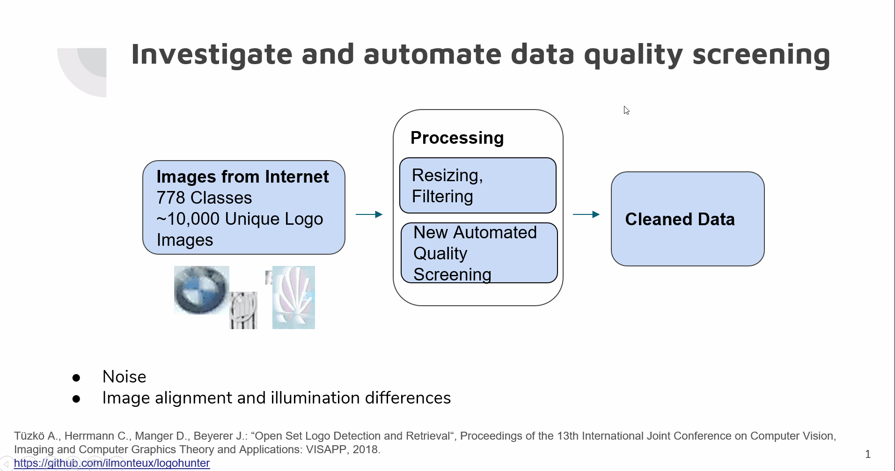
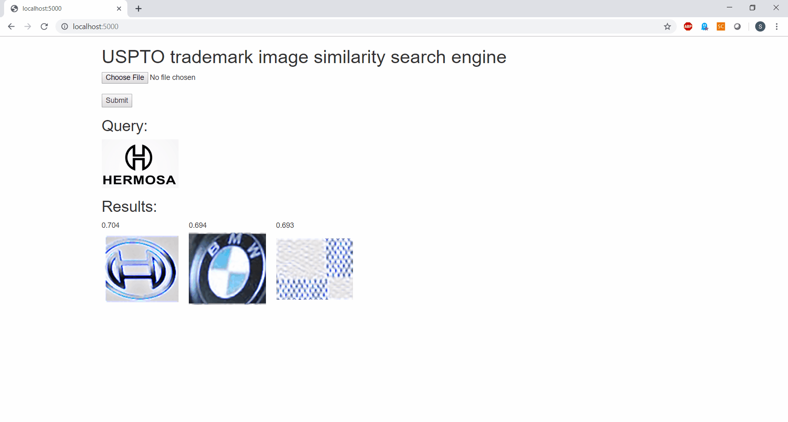
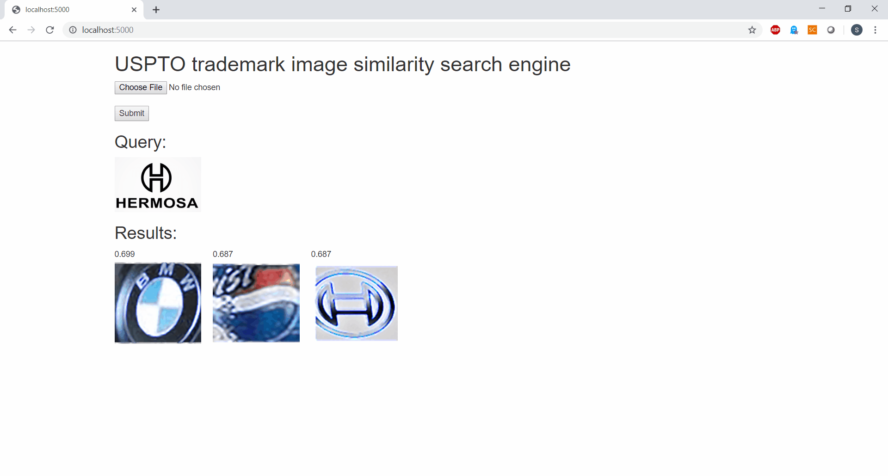

# Overview
Python search engine tool for detecting similar trademarks. Pipeline below for detecting trademark infringement for an institution like US Patent Office



## Repository format:
- **backend** : This contains the directories for storing pretrained models and data. The backend source modules for the project in form of .py files are stored in the directory. <br>
   
  backend/models directory: This contains the pretrained models. The model needs to be downlaoded from the url provided in the "Prerequisites" section. <br>
  backend/data directory: This contains several subdirectories for data storage. Raw_data subdirectory contains input raw logo images downloaded using the url provided in the "Download Raw data on local machine" section. <br>
  Rest of the data subdirectories will be filled automatically during the execution of the program as per the instructions in "Download Raw data on local machine", "Preprocess data", and "Training and feature extraction" sections. <br>
                
                
Attribution: 
https://live.ece.utexas.edu/publications/2011/am_asilomar_2011.pdf <br>
https://github.com/ilmonteux/logohunter (Internet based labeled Logo images) <br>
https://alexisbcook.github.io/2017/global-average-pooling-layers-for-object-localization/ <br>

- **static** : This contains readme_images, semisuper, uploaded subdirectories. <br>
   static/readme_images subdirectory contains images for the README section. static/semisuper contains images that are used for inference. This subdirectory is filled automatically during the execution of the program. <br>
   
- **templates** : Flask web page templates <br>

- **online_search.py** : This maps the web page requests to the backend modules <br>

## Setup
Create virtual environment in conda <br>
Clone repository and change the directory to the project directory<br>
```shell
repo_name=Gita_Insight_Project2019 # URL of your new repository
username=snygt2007 # Username for your personal github account
git clone https://github.com/snygt2007/Gita_Insight_Project2019.git
cd $Gita_Insight_Project2019
```

## Prerequisites

- The packages used to build the code is provided in Requirements.txt <br>
- Please download model from https://tinyurl.com/y2ke7stl in backend/models folder <br>
- Please obtain permission from "Tüzkö A., Herrmann C., Manger D., Beyerer J.: “Open Set Logo Detection and Retrieval“, Proceedings of the 13th International Joint Conference on Computer Vision, Imaging and Computer Graphics Theory and Applications: VISAPP, 2018." for using the input logo images used in this program. Alternatively, you can execute the inference portions. <br>

#### Installation
To install the package above, please run:<br>
pip install -r requiremnts.txt

## Download Raw data on local machine
Execute command to goto the project directory <br>
cd backend <br>
python download_raw_data.py <br>

## Preprocess data
python Create_resized_data.py <br>
python Create_supervised_Data.py <br>

## Training and feature extraction
- A CNN based model is trained with transfer learning technique and the details of the configuration are in <br>
python Image_supervised_model.py. <br>

- Features from the existing logo catalogs are extracted and stored using: <br>
python Extract_semi_supervised_data.py <br>

## Inference
- Instructions for how to run all tests: <br>
(This requires the model to be downloaded in the backend/models folder) <br>
python online_search.py <br>
start localhost:5000 in your local browser (google chrome) <br>
Select a png image for search query. Alternatively, you can select an existing image from the static/semisuper to execute the search. <br>
```
```
# Inference


![Changed settings]


# Future Extension
  The project can be extended in future by creating fake logo images using Generative Adversarial Networks (GAN).  
